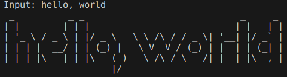
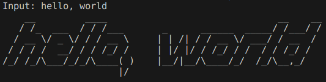

# CS50 FIGlet Solution
CS50’s Introduction to Programming with Python FIGlet problem solution.

This program was developed according with Python's good practices and based on [PEP 8 - Style Guide for Python Code](https://peps.python.org/pep-0008/)

### Version
1.0.0


## Resources
* [CS50 FIGlet Problem](https://cs50.harvard.edu/python/2022/psets/4/figlet/)
* [FIGlet](https://en.wikipedia.org/wiki/FIGlet)
* [FIGlet fonts](http://www.figlet.org/fontdb.cgi)


## Getting Started

These instructions will guide you to copy the project from the repository and run it.

### Prerequisites

Things you need to have installed:
* [pyfiglet library](https://pypi.org/project/pyfiglet/)

### Local Installation

Basically clone the project from the remote repository to the local machine, using the git commands.

```
$git clone [URL].git
```

### Run
To run the project, first check that the pyfiglet library is installed, then run the python command.

To install the pyfiglet library, write the following command-line into the terminal:
```
$pip install pyfiglet
```

### Test
To print your text with the default FIGlet font format, write the command:
```
$python figlet.py
$Input: hello, world
```


To print your text with a specific FIGlet font format, write the command:
```
$python figlet.py -f slant
$Input: hello, world
```



## Authors

* **BEOM &copy; 2024**
